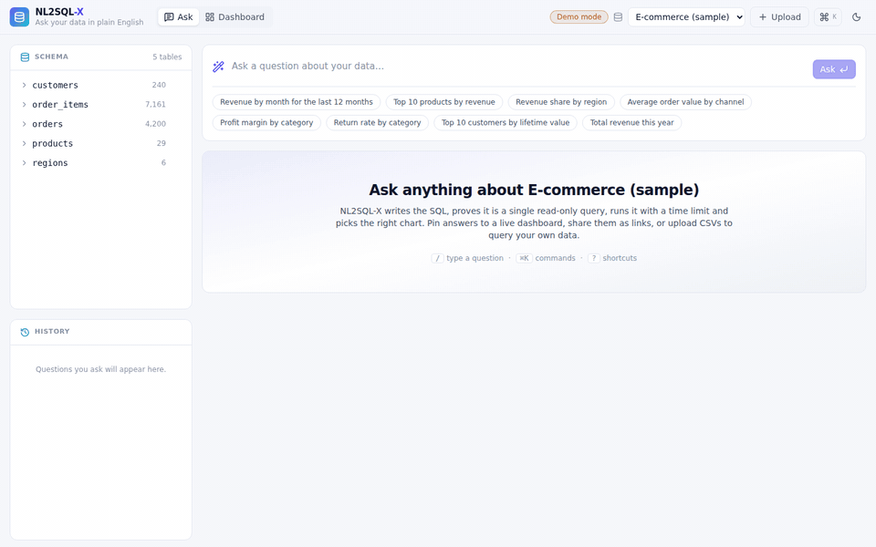
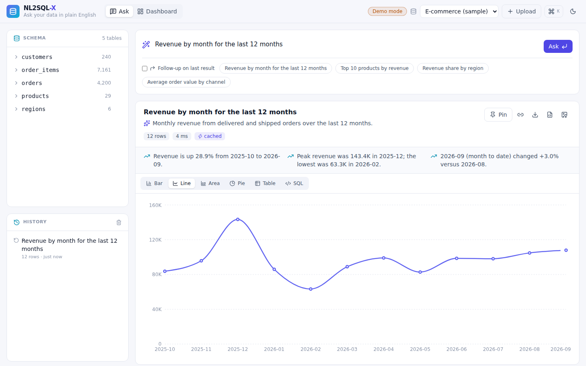
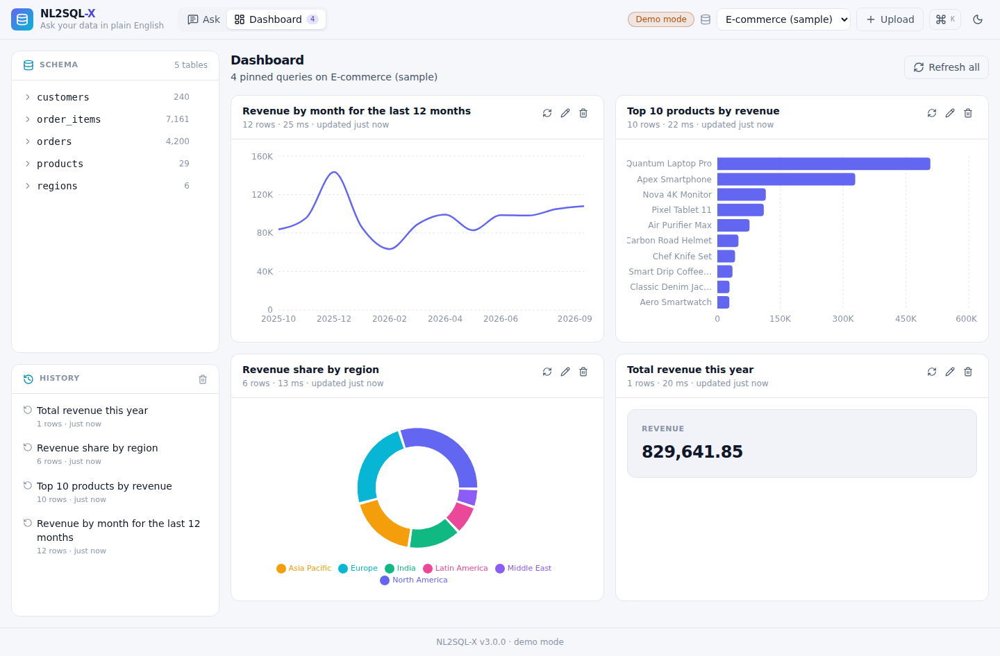
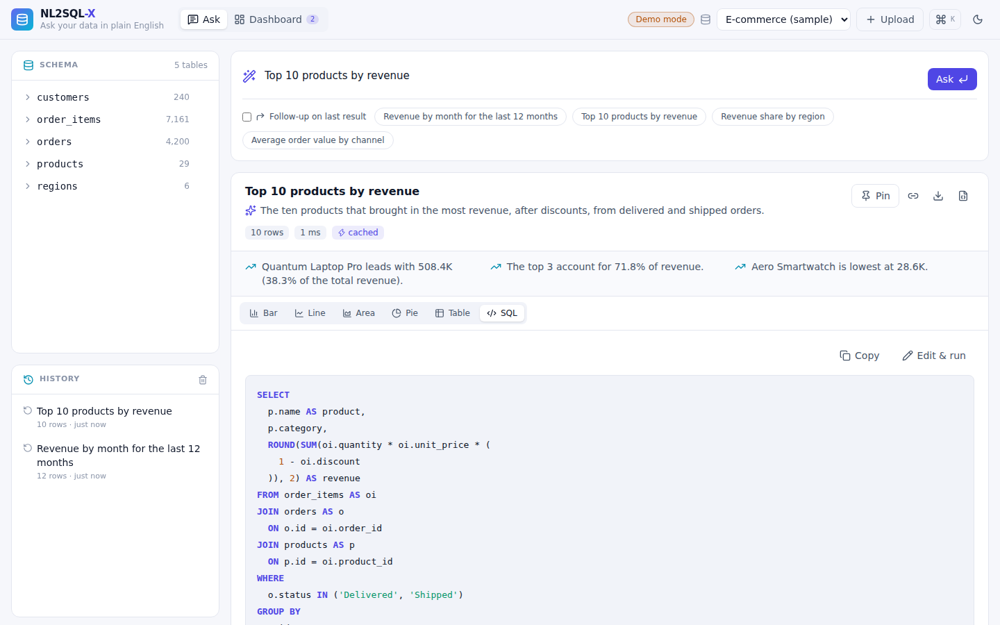
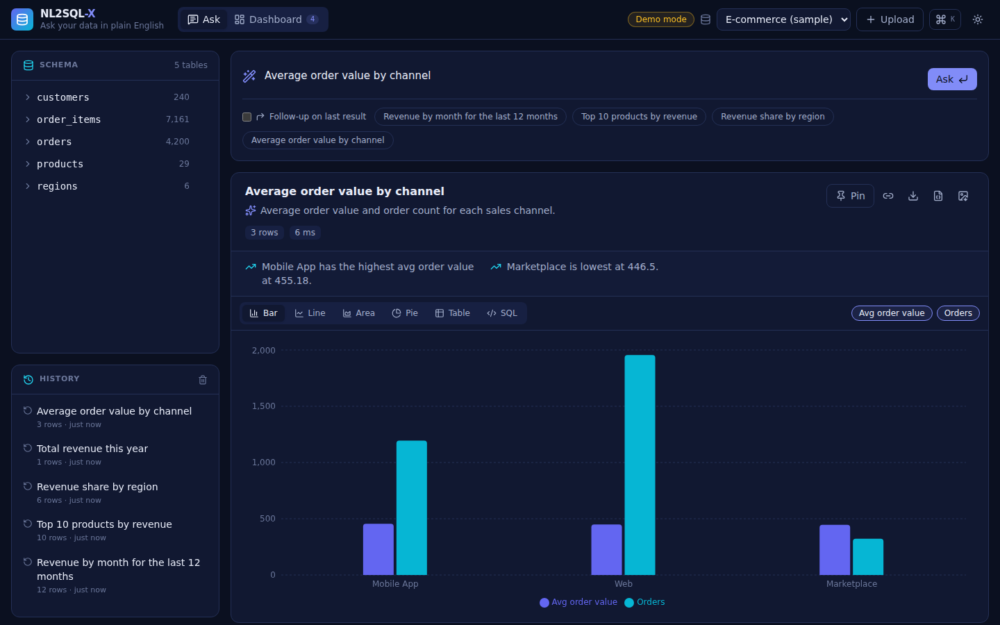
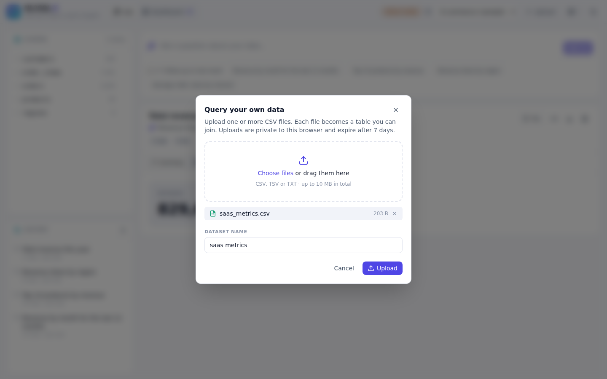
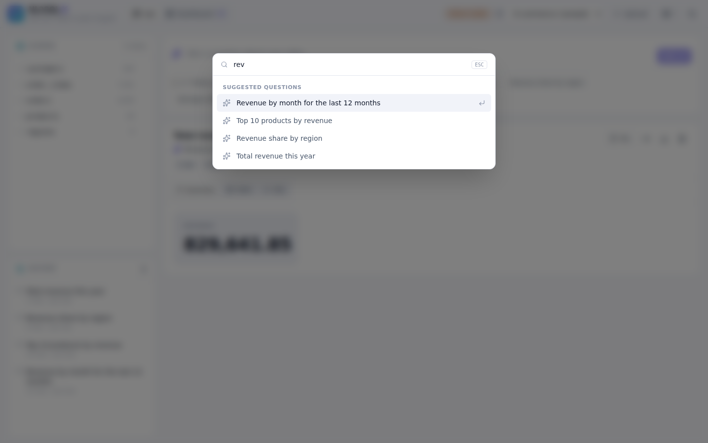
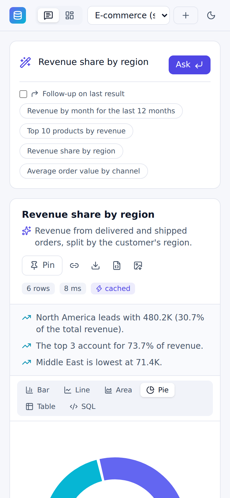
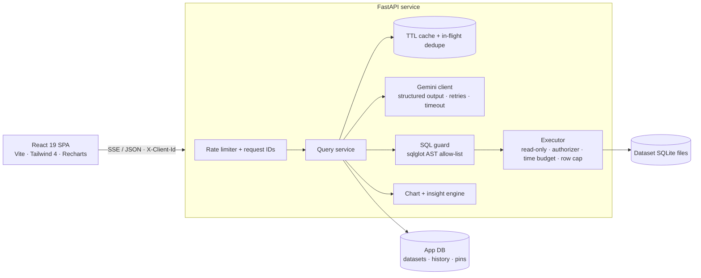

<div align="center">


# NL2SQL-X

**Ask your data in plain English. Get safe SQL, the right chart and a live dashboard.**




[Watch the full-resolution demo (MP4)](docs/media/demo.mp4)

</div>

---

## Why this exists

Most teams have the numbers they need sitting in a database, but getting them out means waiting for someone who writes SQL. NL2SQL-X lets anyone type a question such as *"revenue by month for the last 12 months"* and get back:

1. **SQL written by Gemini** from a live, profiled view of the schema.
2. **A safety check.** The SQL is proven to be a single read-only `SELECT` before it runs.
3. **Real data.** The query runs on a read-only connection with a time budget and a row cap.
4. **A chart chosen from the result's shape** (line, bar, area, pie or a KPI card), plus plain-English highlights that come from the numbers themselves rather than from the model.

Answers can be pinned to a dashboard that re-runs against live data, shared as links, exported, or edited as SQL. Teams can also upload their own CSV files and query them the same way.

## Screenshots

| Answer with insights | Live dashboard |
|---|---|
|  |  |
| **Verified SQL, editable and re-runnable** | **Dark theme with multi-series charts** |
|  |  |
| **Bring your own CSV** | **Command palette (⌘K)** |
|  |  |

<p align="center"></p>

## Features

**Asking**
- Streaming progress: *reading schema → writing SQL → safety check → running query*, delivered over Server-Sent Events.
- Follow-up questions that refine the previous result, for example "only for Europe".
- Self-correction: if a draft fails validation or execution, the error goes back to the model for one repair attempt.
- Identical questions are answered from an LRU/TTL cache. Concurrent identical questions share a single model call.
- A plain-English explanation of every query, plus deterministic insights such as trend, peak, share of total and period-over-period change.

**Exploring**
- Switch any answer between bar, line, area, pie, KPI summary, table and SQL. Toggle series on and off.
- A sortable, filterable, paginated table. Export to CSV (with formula-injection protection), JSON or PNG.
- A schema explorer with sample values and ranges. Click a column to insert it into the question, or preview any table.
- Searchable history with one-click re-run. Shareable deep links (`?q=…`).

**Operating**
- A pinned dashboard per dataset, with rename, refresh and remove.
- CSV/TSV upload: delimiter sniffing, header clean-up, type inference (integer, real, date, datetime), multi-file datasets for joins, per-browser isolation and 7-day expiry.
- Command palette, keyboard shortcuts (`/`, `?`, `g d`, `g a`, `Esc`), dark and light themes, a responsive mobile layout and accessible markup.

## Architecture



| Layer | Choice | Why |
|---|---|---|
| API | FastAPI with async handlers and a thread pool for SQLite | Model calls never block; each SQLite query runs in a worker behind a semaphore |
| Model | Gemini through `google-genai` with a JSON schema response | Typed `{answerable, sql, explanation}` instead of parsing free text |
| Safety | `sqlglot` AST checks **and** the SQLite authorizer on a `mode=ro` connection | Two independent layers: the static guard can be wrong without data being exposed |
| Storage | SQLite (WAL) for app state; one SQLite file per dataset | Zero-ops, fast, and datasets are isolated from each other |
| Frontend | React 19, strict TypeScript, Tailwind 4, Recharts loaded lazily | Initial bundle about 91 KB gzip; charts load in the background |

## Security model

A generated query has to pass every layer below before it returns data:

1. **Static guard.** The SQL must parse as exactly one statement, and that statement must be a `SELECT`, `WITH … SELECT` or a set operation. The guard also rejects:
   - DDL, DML, `PRAGMA`, `ATTACH` and transactions anywhere in the syntax tree;
   - dangerous functions such as `load_extension`, `readfile` and `randomblob`;
   - table-valued functions;
   - schema-qualified names;
   - any table that is not part of the selected dataset.
2. **Runtime authorizer.** The query runs on a read-only URI connection with `PRAGMA query_only`. A SQLite authorizer allows only reads of the dataset's tables and denies every other action.
3. **Resource limits.** A progress-handler time budget (default 3 s) interrupts runaway queries, including recursive CTEs. At most *N* rows are fetched, and the response carries a `truncated` flag.
4. **Isolation.** Uploaded datasets, history and pins are scoped to the browser's client ID. They are not visible to other clients, and they expire.
5. **HTTP hardening.** The API adds a per-IP sliding-window rate limit that only trusts the configured proxy hops. It also enforces upload size, row and column caps, sets security headers and request IDs, and never leaks internal errors.

> The client ID is a scoping key, not authentication. For multi-tenant production use, put the service behind your identity provider and map users to client IDs.

## Quality

| Suite | Tests | What it covers |
|---|---:|---|
| Backend (pytest) | 171 | SQL guard attack cases, executor sandbox, ingestion, charts, insights, API contract, SSE streaming, pins, cache and in-flight dedupe, Gemini retries and model fallback, config validation |
| Frontend (Vitest + Testing Library) | 32 | Formatting, CSV escaping, SSE parser, API client, table, composer, command palette, result view |
| End-to-end (Playwright) | 28 | Every button and view in a real browser: asking, view switching, downloads, share links, SQL editing, unsafe SQL, history, dashboard, upload, palette, shortcuts, theme, mobile |
| **Total** | **231** | Backend line coverage: **96%** |

**Load test** (`scripts/load_test.py`, one Uvicorn worker, sample dataset, demo model so that only our own code is measured):

| Scenario | Throughput | Errors | p50 | p95 |
|---|---:|---:|---:|---:|
| 1 user | 180 req/s | 0 | 4–7 ms | 6–10 ms |
| 50 concurrent users, no think time | 192 req/s | 0 / 5,793 | 136–295 ms | 182–353 ms |

In production the model call dominates latency, typically 1–3 s. The cache and in-flight deduplication remove that cost for repeated questions.

## Quick start

**Requirements:** Python 3.11+, Node 22+, and a [Gemini API key](https://aistudio.google.com/apikey). Without a key the app runs in **demo mode**, which answers the suggested questions.

```bash
git clone https://github.com/pavan-dangeti/NL2SQL-X.git && cd NL2SQL-X

# Backend
python -m venv .venv && source .venv/bin/activate
pip install -r backend/requirements-dev.txt
cp .env.example backend/.env        # add GEMINI_API_KEY
cd backend && uvicorn app.main:app --reload --port 8000

# Frontend (second terminal)
cd frontend && npm ci && npm run dev   # http://localhost:5173
```

To run everything from a single process instead, build the frontend (`cd frontend && npm run build`). The API then serves it at `http://localhost:8000`.

### Tests

```bash
pytest                                          # backend + coverage config in pyproject.toml
cd frontend && npm test                         # Vitest
cd frontend && npm run build && cd .. && pytest e2e   # Playwright (python -m playwright install chromium)
python scripts/load_test.py --base http://localhost:8000 --users 50
```

## Configuration

| Variable | Default | Purpose |
|---|---|---|
| `GEMINI_API_KEY` | — | Enables the model; without it the app runs in demo mode |
| `GEMINI_MODEL` | `gemini-3.8-flash` | Any Gemini model that supports structured output |
| `GEMINI_FALLBACK_MODEL` | `gemini-3.5-flash-lite` | Used automatically when the main model is rate-limited or unavailable |
| `GEMINI_THINKING_LEVEL` | `low` | `minimal` / `low` / `medium` / `high`; lower is faster. Dropped automatically if a model does not support it |
| `LLM_PROVIDER` | `gemini` | Set to `demo` for keyless demos and tests |
| `QUERY_TIMEOUT_MS` | `3000` | Per-query time budget |
| `MAX_RESULT_ROWS` | `1000` | Row cap per answer |
| `REPAIR_ATTEMPTS` | `1` | Self-correction rounds |
| `CACHE_SIZE` / `CACHE_TTL_S` | `512` / `3600` | Answer cache |
| `RATE_LIMIT_PER_MINUTE` | `30` | Per-IP limit on questions, SQL runs and uploads |
| `TRUSTED_PROXY_HOPS` | `0` | Set to `2` behind Vercel + Render |
| `MAX_UPLOAD_MB` / `DATASET_TTL_DAYS` | `10` / `7` | Upload limits |
| `CORS_ORIGINS` | `http://localhost:5173` | Comma-separated list; wildcards are rejected in production |

## Deployment (free tier)

1. **Render (API).** Choose **New → Blueprint**, pick this repository, and it will read `render.yaml`. Set `GEMINI_API_KEY`. The Docker image builds the frontend too, so the Render URL is already a working app.
2. **Vercel (frontend).** Import the repository, set **Framework: Other**, and leave the root directory as `./`. `vercel.json` builds `frontend/` and proxies `/api` to `https://nl2sql-x.onrender.com`. Change that host if your Render service has a different name.

The free Render plan sleeps after 15 minutes of inactivity, so the first request can take about a minute. Its disk is ephemeral: the sample dataset is rebuilt automatically, but uploads and pins reset on redeploy.

## API

The interactive OpenAPI docs are at `/api/docs`.

| Method | Path | Description |
|---|---|---|
| `POST` | `/api/v1/query` | Ask a question. Send `Accept: text/event-stream` to receive `stage` events followed by `result` or `error` |
| `POST` | `/api/v1/sql` | Validate and run edited SQL |
| `GET` | `/api/v1/datasets` · `POST` · `DELETE /{id}` | List, upload (multipart CSV) or delete datasets |
| `GET` | `/api/v1/datasets/{id}/schema` · `/suggestions` · `/tables/{t}/preview` | Profiled schema, suggested questions, table preview |
| `GET` · `DELETE` | `/api/v1/history` | Per-client history |
| `GET` · `POST` · `PATCH` · `DELETE` | `/api/v1/pins`, `POST /api/v1/pins/{id}/run` | Dashboard pins |
| `GET` | `/health/live`, `/health/ready` | Probes |

## Project layout

```
backend/app/     config · main (HTTP) · service (orchestration) · llm · prompts · sql_guard
                 executor · schema · charts · insights · ingest · store · demo_data · limits · logs
backend/tests/   pytest suites
frontend/src/    App · components/ (ResultView, ChartView, DataTable, Dashboard, CommandPalette, …) · lib/
e2e/             Playwright browser tests
scripts/         load_test.py · capture_media.py (regenerates the screenshots and demo video)
```

## Roadmap

- Postgres and MySQL connectors through read-only roles
- SSO and per-team workspaces
- Scheduled dashboard snapshots by email or Slack
- An evaluation harness that scores SQL accuracy on a benchmark set of questions

## License

[MIT](LICENSE)
